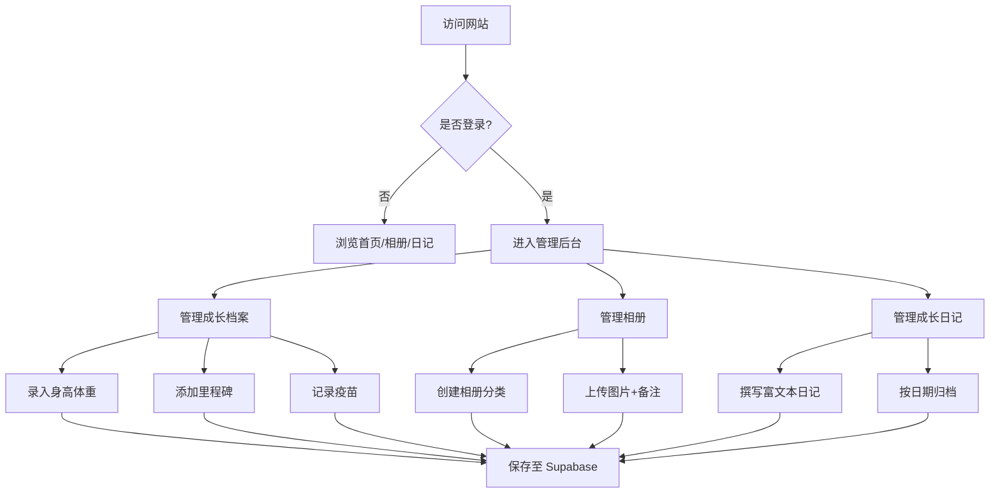

## 1. 产品概述

儿童成长历程记录网站——为年轻家庭打造的一站式宝宝成长记录平台，支持记录身高体重、发育里程碑、疫苗、照片和日记，让每一个珍贵瞬间都不会被遗忘。

- 目标用户：0-6岁宝宝的父母/监护人，希望系统化记录孩子成长历程
- 核心价值：将零散的成长数据整合为可视化、可回溯的成长档案，提供温馨童趣的记录体验

## 2. 核心功能

### 2.1 用户角色

| 角色 | 注册/登录方式 | 核心权限 |
|------|--------------|---------|
| 管理员（家长） | 邮箱密码登录 | 所有内容增删改查、批量上传图片、后台管理 |
| 访客 | 无需登录 | 浏览首页、查看公开内容 |

### 2.2 功能模块

1. **首页**：宝宝简介卡片、实时年龄计时器、时光轴、精选照片轮播
2. **成长档案**：按月录入身高体重、发育里程碑标记、疫苗记录，生成成长折线图
3. **相册模块**：多分类相册（如日常、旅行、节日等）、图片上传+文字备注、大图预览灯箱
4. **成长日记**：富文本编辑写随笔、按日期归档浏览
5. **管理后台**：管理员登录、所有内容增删改查、批量上传图片

### 2.3 页面详情

| 页面名称 | 模块名称 | 功能描述 |
|---------|---------|---------|
| 首页 | 宝宝简介卡片 | 展示宝宝姓名、出生日期、头像、个性签名 |
| 首页 | 年龄计时器 | 实时显示 X岁X月X天X时X分X秒 |
| 首页 | 时光轴 | 纵向时间线展示重要成长事件 |
| 首页 | 精选照片轮播 | 自动轮播+手动切换的精选照片展示 |
| 成长档案 | 身高体重录入 | 按月录入数据，支持编辑删除 |
| 成长档案 | 成长折线图 | Chart.js 绘制身高/体重变化曲线 |
| 成长档案 | 发育里程碑 | 记录翻身、坐、爬、走、说话等关键节点 |
| 成长档案 | 疫苗记录 | 记录接种时间、疫苗名称、接种状态 |
| 相册 | 分类相册列表 | 按分类展示相册封面和名称 |
| 相册 | 图片上传 | 支持单张/批量上传，添加文字备注 |
| 相册 | 大图预览 | 灯箱模式查看大图，左右切换 |
| 成长日记 | 日记列表 | 按日期倒序展示日记摘要 |
| 成长日记 | 日记编辑 | 富文本编辑器，支持加粗、列表、图片等 |
| 管理后台 | 登录页 | 邮箱密码登录，Supabase Auth 认证 |
| 管理后台 | 内容管理 | 所有模块的增删改查操作面板 |
| 管理后台 | 批量上传 | 多文件拖拽上传至 Supabase Storage |

## 3. 核心流程

**访客浏览流程**：访问首页 → 查看宝宝简介和时光轴 → 浏览相册 → 阅读成长日记

**管理员操作流程**：登录后台 → 选择管理模块（档案/相册/日记）→ 新增/编辑/删除内容 → 保存至 Supabase

## 4. 用户界面设计

### 4.1 设计风格

- **主色调**：浅粉色 `#FFB6C1`、浅蓝色 `#A8D8EA`，搭配暖白 `#FFF8F0` 背景
- **辅助色**：柔黄 `#FFE5A0`、薄荷绿 `#B5EAD7`、淡紫 `#C7CEEA`
- **按钮风格**：大圆角（rounded-2xl）、柔和阴影、hover 微弹跳动画
- **字体**：标题使用圆润可爱的字体，正文使用清晰易读的圆体
- **布局风格**：卡片式布局、圆角容器、柔和阴影、留白充足
- **图标/装饰**：星星、云朵、气球等童趣装饰元素，CSS 绘制或 SVG 图标

### 4.2 页面设计概览

| 页面名称 | 模块名称 | UI 元素 |
|---------|---------|---------|
| 首页 | 宝宝简介卡片 | 圆形头像、圆角卡片、柔和渐变背景、星星装饰 |
| 首页 | 年龄计时器 | 数字翻牌效果、浅粉蓝渐变底色 |
| 首页 | 时光轴 | 纵向虚线+圆点节点、左右交替卡片、云朵装饰 |
| 首页 | 精选照片轮播 | 大圆角轮播、淡入淡出切换、圆点指示器 |
| 成长档案 | 数据录入表单 | 圆角输入框、柔和边框、彩色标签页切换 |
| 成长档案 | 成长折线图 | 浅色背景图表、渐变填充区域、圆点标记 |
| 相册 | 相册网格 | 圆角图片卡片、hover 放大效果、分类标签 |
| 相册 | 大图预览 | 半透明遮罩、居中大图、左右箭头切换 |
| 成长日记 | 日记列表 | 日期标签、摘要卡片、渐变分隔线 |
| 成长日记 | 编辑器 | 简洁工具栏、圆角编辑区域 |
| 管理后台 | 登录页 | 居中卡片表单、可爱插画装饰 |
| 管理后台 | 管理面板 | 侧边栏导航、数据表格、操作按钮 |

### 4.3 响应式适配

- **桌面优先**设计，最小宽度 320px 适配
- **手机端**：单列布局、底部导航栏、卡片全宽、大图预览全屏
- **平板端**：双列卡片布局、侧边栏可折叠
- **桌面端**：三列/四列网格、固定侧边栏、宽敞留白
- 触摸优化：按钮最小 44px 点击区域、滑动切换轮播

### 4.4 3D 场景

不适用
