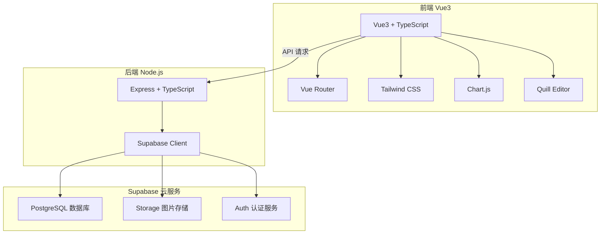
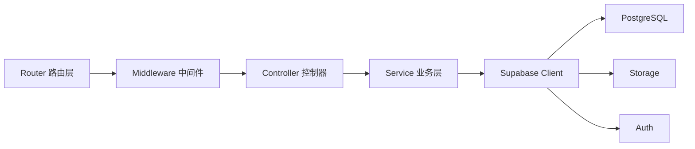
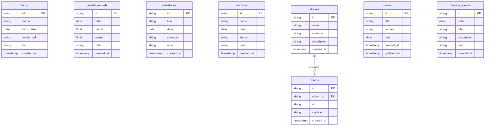

## 1. 架构设计



## 2. 技术说明

- **前端**：Vue3 + TypeScript + Tailwind CSS + Vite
- **初始化工具**：vite-init (vue-express-ts 模板)
- **后端**：Express + TypeScript (ESM)
- **数据库**：Supabase PostgreSQL（云端托管）
- **图片存储**：Supabase Storage
- **认证**：Supabase Auth（邮箱密码登录）
- **图表**：Chart.js（成长折线图）
- **富文本**：Quill.js（成长日记编辑器）
- **图标**：Lucide Vue Next

## 3. 路由定义

| 路由 | 用途 |
|------|------|
| `/` | 首页：宝宝简介、年龄计时、时光轴、精选照片 |
| `/growth` | 成长档案：身高体重、里程碑、疫苗、折线图 |
| `/album` | 相册列表：分类相册展示 |
| `/album/:id` | 相册详情：图片网格、上传、大图预览 |
| `/diary` | 成长日记列表：按日期归档 |
| `/diary/:id` | 日记详情：富文本内容展示 |
| `/admin` | 管理后台登录页 |
| `/admin/dashboard` | 管理面板：内容增删改查 |

## 4. API 定义

### 4.1 宝宝信息

```typescript
// GET /api/baby - 获取宝宝信息
interface Baby {
  id: string
  name: string
  birth_date: string       // ISO 日期
  avatar_url: string
  bio: string
  created_at: string
}

// PUT /api/baby - 更新宝宝信息
```

### 4.2 成长数据

```typescript
// GET /api/growth/records - 获取身高体重记录
interface GrowthRecord {
  id: string
  date: string             // 记录日期
  height: number           // 身高 cm
  weight: number           // 体重 kg
  note: string
  created_at: string
}

// POST /api/growth/records - 新增记录
// PUT /api/growth/records/:id - 更新记录
// DELETE /api/growth/records/:id - 删除记录
```

### 4.3 里程碑

```typescript
// GET /api/milestones - 获取发育里程碑
interface Milestone {
  id: string
  title: string            // 如"第一次翻身"
  date: string
  category: string         // 运动/语言/认知/社交
  note: string
  created_at: string
}

// POST /api/milestones - 新增里程碑
// PUT /api/milestones/:id - 更新里程碑
// DELETE /api/milestones/:id - 删除里程碑
```

### 4.4 疫苗记录

```typescript
// GET /api/vaccines - 获取疫苗记录
interface Vaccine {
  id: string
  name: string             // 疫苗名称
  date: string             // 接种日期
  status: 'completed' | 'scheduled'  // 已接种/计划中
  note: string
  created_at: string
}

// POST /api/vaccines - 新增疫苗记录
// PUT /api/vaccines/:id - 更新疫苗记录
// DELETE /api/vaccines/:id - 删除疫苗记录
```

### 4.5 相册

```typescript
// GET /api/albums - 获取相册列表
interface Album {
  id: string
  name: string             // 相册名称
  cover_url: string        // 封面图
  description: string
  photo_count: number
  created_at: string
}

// POST /api/albums - 创建相册
// PUT /api/albums/:id - 更新相册
// DELETE /api/albums/:id - 删除相册
```

### 4.6 照片

```typescript
// GET /api/albums/:albumId/photos - 获取相册照片
interface Photo {
  id: string
  album_id: string
  url: string              // Supabase Storage URL
  caption: string          // 文字备注
  created_at: string
}

// POST /api/albums/:albumId/photos - 上传照片（multipart/form-data）
// DELETE /api/photos/:id - 删除照片
```

### 4.7 成长日记

```typescript
// GET /api/diaries - 获取日记列表
interface Diary {
  id: string
  title: string
  content: string          // 富文本 HTML
  date: string             // 日记日期
  created_at: string
  updated_at: string
}

// POST /api/diaries - 创建日记
// PUT /api/diaries/:id - 更新日记
// DELETE /api/diaries/:id - 删除日记
```

### 4.8 时光轴事件

```typescript
// GET /api/timeline - 获取时光轴事件
interface TimelineEvent {
  id: string
  date: string
  title: string
  description: string
  icon: string             // 图标标识
  created_at: string
}

// POST /api/timeline - 新增事件
// PUT /api/timeline/:id - 更新事件
// DELETE /api/timeline/:id - 删除事件
```

### 4.9 认证

```typescript
// POST /api/auth/login - 管理员登录
interface LoginRequest {
  email: string
  password: string
}
interface LoginResponse {
  access_token: string
  user: { id: string; email: string }
}

// POST /api/auth/logout - 退出登录
// GET /api/auth/me - 获取当前用户信息
```

## 5. 服务器架构图



## 6. 数据模型

### 6.1 数据模型定义



### 6.2 数据定义语言

```sql
-- 宝宝信息表
CREATE TABLE baby (
  id UUID DEFAULT gen_random_uuid() PRIMARY KEY,
  name TEXT NOT NULL,
  birth_date DATE NOT NULL,
  avatar_url TEXT,
  bio TEXT DEFAULT '',
  created_at TIMESTAMPTZ DEFAULT NOW()
);

-- 成长记录表（身高体重）
CREATE TABLE growth_records (
  id UUID DEFAULT gen_random_uuid() PRIMARY KEY,
  date DATE NOT NULL,
  height DECIMAL(5,1),
  weight DECIMAL(5,2),
  note TEXT DEFAULT '',
  created_at TIMESTAMPTZ DEFAULT NOW()
);

-- 发育里程碑表
CREATE TABLE milestones (
  id UUID DEFAULT gen_random_uuid() PRIMARY KEY,
  title TEXT NOT NULL,
  date DATE NOT NULL,
  category TEXT NOT NULL CHECK (category IN ('运动', '语言', '认知', '社交')),
  note TEXT DEFAULT '',
  created_at TIMESTAMPTZ DEFAULT NOW()
);

-- 疫苗记录表
CREATE TABLE vaccines (
  id UUID DEFAULT gen_random_uuid() PRIMARY KEY,
  name TEXT NOT NULL,
  date DATE NOT NULL,
  status TEXT NOT NULL CHECK (status IN ('completed', 'scheduled')),
  note TEXT DEFAULT '',
  created_at TIMESTAMPTZ DEFAULT NOW()
);

-- 相册表
CREATE TABLE albums (
  id UUID DEFAULT gen_random_uuid() PRIMARY KEY,
  name TEXT NOT NULL,
  cover_url TEXT,
  description TEXT DEFAULT '',
  created_at TIMESTAMPTZ DEFAULT NOW()
);

-- 照片表
CREATE TABLE photos (
  id UUID DEFAULT gen_random_uuid() PRIMARY KEY,
  album_id UUID REFERENCES albums(id) ON DELETE CASCADE,
  url TEXT NOT NULL,
  caption TEXT DEFAULT '',
  created_at TIMESTAMPTZ DEFAULT NOW()
);

-- 成长日记表
CREATE TABLE diaries (
  id UUID DEFAULT gen_random_uuid() PRIMARY KEY,
  title TEXT NOT NULL,
  content TEXT DEFAULT '',
  date DATE NOT NULL,
  created_at TIMESTAMPTZ DEFAULT NOW(),
  updated_at TIMESTAMPTZ DEFAULT NOW()
);

-- 时光轴事件表
CREATE TABLE timeline_events (
  id UUID DEFAULT gen_random_uuid() PRIMARY KEY,
  date DATE NOT NULL,
  title TEXT NOT NULL,
  description TEXT DEFAULT '',
  icon TEXT DEFAULT 'star',
  created_at TIMESTAMPTZ DEFAULT NOW()
);

-- 初始数据：插入默认宝宝信息
INSERT INTO baby (name, birth_date, bio) VALUES ('小宝贝', '2024-01-01', '欢迎来到我的成长世界！');
```
